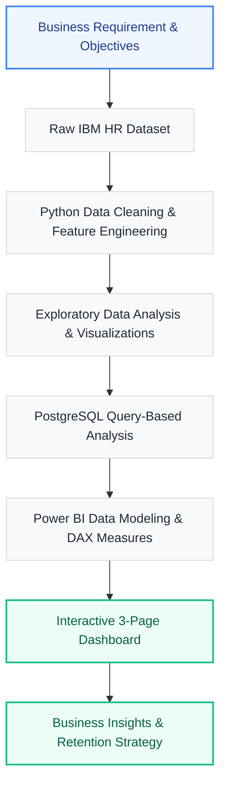
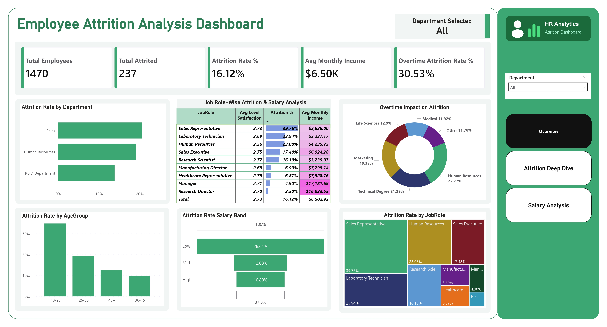
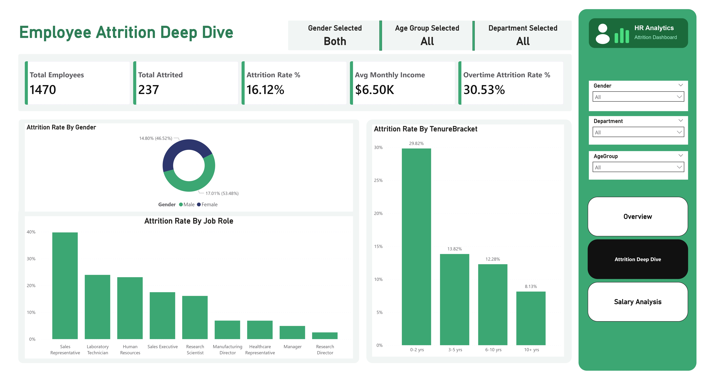
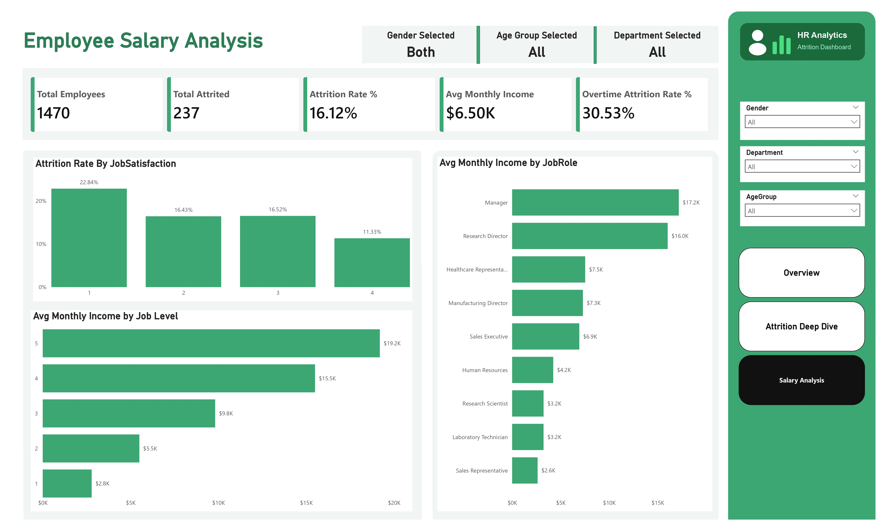

<div align="center">

# 📊 HR Analytics & Employee Attrition Dashboard
### 🚀 End-to-End Data Analytics Project using Python, PostgreSQL, and Power BI

This project analyzes employee attrition patterns using HR data and converts raw data into actionable business insights through data cleaning, exploratory analysis, SQL-based investigation, and an interactive Power BI dashboard.

[](notebooks/hr_analysis.ipynb)
[](dashboard/hr_dashboard.pbix)
[](scripts/hr_analysis.sql)

</div>

---

## 📌 Table of Contents

- [Project Overview](#-project-overview)
- [Business Problem & Objectives](#-business-problem--objectives)
- [Dataset Specifications](#-dataset-specifications)
- [Tech Stack & Tools](#-tech-stack--tools)
- [Project Workflow](#-project-workflow)
- [Repository Structure](#-repository-structure)
- [Dashboard Preview & Pages](#-dashboard-preview--pages)
- [Key Business Insights](#-key-business-insights)
- [Actionable Business Recommendations](#-actionable-business-recommendations)
- [How to Run This Project](#-how-to-run-this-project)
- [Sub-Module Documentation](#-sub-module-documentation)
- [Author](#-author)

---

## 🔍 Project Overview

Employee attrition is one of the most important HR challenges because it directly affects hiring cost, team stability, productivity, and organizational knowledge retention.

This project uses the IBM HR Analytics Employee Attrition dataset to identify the major factors influencing employee exits. The final output is a 3-page Power BI dashboard that helps HR teams monitor attrition, compare risk segments, and make data-driven retention decisions.

The project covers the complete analytics lifecycle:
*   **Business problem understanding** & goal definition.
*   **Data cleaning & preparation** using Python (Pandas).
*   **Exploratory Data Analysis (EDA)** & visualization (Seaborn/Matplotlib).
*   **SQL-based business analysis** using PostgreSQL database queries.
*   **Data modeling, DAX measures, & dashboard creation** in Power BI.
*   **Insight generation & strategic recommendations** for HR leadership.

---

## 💼 Business Problem & Objectives

### 🚨 The Problem
A mid-sized organization is facing an employee attrition rate of approximately **16%**. High attrition increases recruitment costs, reduces team efficiency, and creates knowledge gaps across departments.

### 🎯 Business Goal
Identify the main drivers of employee attrition and build an interactive dashboard for HR leadership to support retention strategy decisions, with a target of reducing attrition from **16% to below 12%**.

### 📋 Key Objectives
1. Analyze overall employee attrition trends and KPIs.
2. Identify high-risk departments, job roles, age groups, and tenure groups.
3. Understand the impact of overtime, salary, satisfaction, and work-life balance on attrition.
4. Create SQL queries to answer business-focused HR questions.
5. Build an interactive Power BI dashboard for HR decision-makers.
6. Convert analysis findings into practical business recommendations.

---

## 📊 Dataset Specifications

| Attribute | Details |
| :--- | :--- |
| **Dataset Name** | IBM HR Analytics Employee Attrition Dataset |
| **Source** | [Kaggle - IBM HR Analytics Attrition Dataset](https://www.kaggle.com/datasets/pavansubhasht/ibm-hr-analytics-attrition-dataset) |
| **Total Records** | 1,470 employees |
| **Total Features** | 35 columns |
| **Target Variable** | Attrition (Yes / No) |
| **Use Case** | HR analytics, attrition analysis, employee retention strategy |

---

## 🛠️ Tech Stack & Tools

*   **Python (Pandas, Numpy)** — Data cleaning, feature engineering, and preprocessing.
*   **Matplotlib & Seaborn** — Exploratory data visualization.
*   **PostgreSQL** — SQL-based business queries and database analysis.
*   **Power BI** — Interactive dashboard development.
*   **DAX (Data Analysis Expressions)** — KPI measures and calculated metrics.
*   **Jupyter Notebook** — Code documentation and interactive analysis.
*   **GitHub** — Project presentation and version control.

---

## Project Workflow



---

## Repository Structure

```text
HR-Analytics-Dashboard/
│
├── data/
│   ├── hr_raw.csv                     # Original raw dataset
│   └── hr_cleaned.csv                 # Cleaned dataset ready for SQL & Power BI
│
├── notebooks/
│   ├── hr_analysis.ipynb              # Jupyter notebook for cleaning & EDA
│   └── README.md                      # Python cleaning & EDA documentation
│
├── scripts/
│   ├── hr_analysis.sql                # PostgreSQL business analysis queries
│   └── README.md                      # SQL queries and insights documentation
│
├── charts/
│   ├── chart1_attrition_overview.png
│   ├── chart2_attrition_by_dept.png
│   ├── chart3_attrition_by_age.png
│   ├── chart4_income_by_jobrole.png
│   ├── chart5_overtime_attrition.png
│   ├── chart6_correlation_heatmap.png
│   └── chart7_attrition_by_salary.png
│
├── dashboard/
│   ├── hr_dashboard.pbix              # Power BI Dashboard file
│   └── README.md                      # Dashboard metrics and design choices
│
└── screenshots/
    ├── Star_schema.png
    ├── screenshot_page1_overview.jpg
    ├── screenshot_page2_attrition_deep_dive.jpg
    └── screenshot_page3_salary_analysis.jpg
```

---

## 🖥️ Dashboard Preview & Pages

### 📍 Page 1: HR Overview

*This page provides a high-level view of total employees, attrition count, attrition rate, average salary, and overall workforce distribution.*

---

### 📍 Page 2: Attrition Deep Dive

*This page focuses on attrition patterns across departments, job roles, age groups, overtime status, satisfaction levels, and tenure groups.*

---

### 📍 Page 3: Salary Analysis

*This page analyzes salary distribution, monthly income by job role, salary-based attrition risk, and income comparison across employee groups.*

---

## 💡 Key Business Insights

| # | Insight Area | Key Finding | Attrition Detail |
|---|---|---|---|
| **1** | **Department Risk** | **Sales department** has the highest attrition rate. | **~20%** attrition |
| **2** | **Overtime Impact** | Employees working **overtime** show extremely high attrition. | **30.53%** vs **10%** (3x higher!) |
| **3** | **Age Group Risk** | Young professionals aged **18–25** show the highest exit rates. | **~34%** attrition |
| **4** | **Tenure Risk** | Employees in their first **0–2 years** are highly likely to leave. | **29.82%** attrition |
| **5** | **Salary Impact** | **Sales Representatives** have low monthly income and high exits. | High compensation-related risk |
| **6** | **Satisfaction** | Employees with low satisfaction have double the attrition rate. | Strong correlation with attrition |
| **7** | **Gender Pay** | The dataset shows no major average salary gap between genders. | Balanced compensation equity |

---

## 📋 Actionable Business Recommendations

Based on the analysis, HR leadership should focus on the following strategic interventions:

> [!WARNING]
> ### 1. Reduce Overtime Dependency
> Overtime is one of the strongest attrition indicators (30% vs 10%). HR should monitor overtime-heavy teams, adjust workloads, and increase headcount where necessary.

> [!IMPORTANT]
> ### 2. Improve Early-Tenure Employee Experience
> Since employees in their first two years show a high exit rate (~30%), the company should strengthen onboarding programs, establish mentorship, and clarify career paths early on.

> [!TIP]
> ### 3. Focus on Young Employee Retention
> Employees aged 18–25 are most likely to leave. HR should introduce continuous learning opportunities, rotation programs, and regular engagement check-ins.

> [!NOTE]
> ### 4. Review Compensation for High-Risk Roles
> Sales Representatives show high attrition and low average income. Compensation benchmarking and restructuring commissions or incentives can help reduce exits.

---

## ⚙️ How to Run This Project

### 1. Clone the Repository
```bash
git clone https://github.com/yashawasthi27/HR-Analytics-Dashboard.git
cd HR-Analytics-Dashboard
```

### 2. Run Python Analysis & Data Cleaning
Install required Python libraries:
```bash
pip install pandas numpy matplotlib seaborn jupyter
```
Launch Jupyter Notebook to view or run the data preparation notebook:
```bash
jupyter notebook notebooks/hr_analysis.ipynb
```

### 3. Setup SQL Analysis in PostgreSQL
Create a database in your PostgreSQL instance:
```sql
CREATE DATABASE hr_analytics;
```
Import `data/hr_cleaned.csv` into a table and execute the SQL queries located in `scripts/hr_analysis.sql`.

### 4. Open Power BI Dashboard
Open the Power BI file:
```text
dashboard/hr_dashboard.pbix
```
*Note: Update the data source path inside Power BI to your local `hr_cleaned.csv` and click **Refresh**.*

---

## 📖 Sub-Module Documentation

| Module | Purpose / Focus | Documentation Link |
|---|---|---|
| 🐍 **Python EDA** | Data cleaning, feature engineering, and exploratory analysis | [notebooks/README.md](notebooks/README.md) |
| 🗄️ **SQL Analysis** | Business questions solved using PostgreSQL queries | [scripts/README.md](scripts/README.md) |
| 📊 **Power BI Dashboard** | Dashboard layout, DAX formulas, and design guidelines | [dashboard/README.md](dashboard/README.md) |

---

## 👤 Author

**Yash Awasthi**  
*BCA Student - Artificial Intelligence & Data Science*  
*Aspiring Data Analyst*

<p align="left">
  <a href="https://linkedin.com/in/yashawasthi27"></a>
  <a href="https://github.com/yashawasthi27"></a>
  <a href="https://yashawasthi27.github.io/Portfolio/"></a>
</p>

Email: [yashonwork247@gmail.com](mailto:yashonwork247@gmail.com)

---

<div align="center">

**If you found this project useful, consider starring the repository ⭐**

</div>
