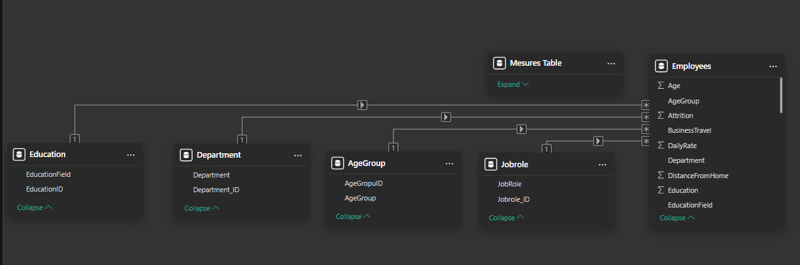

# 📊 Power BI Dashboard Module: HR Analytics

> This module details the design architecture, star schema data model, DAX measures, and page layout of the interactive 3-page Power BI dashboard.

---

## 🗂️ Star Schema Data Model

The data model uses a clean star schema design to ensure high-performing queries, logical relationship mapping, and easy-to-use filter directions.



### Table Metadata & Keys

| Table Name | Type | Record Count | Join / Key Column |
| :--- | :--- | :--- | :--- |
| **`hr_cleaned`** | Fact Table | 1,470 rows | — |
| **`Dim_Department`** | Dimension | 3 rows | `DepartmentID` |
| **`Dim_JobRole`** | Dimension | 9 rows | `JobRoleID` |
| **`Dim_AgeGroup`** | Dimension | 4 rows | `AgeGroupID` |
| **`Dim_Education`** | Dimension | 6 rows | `EducationID` |

---

## 📐 Calculated DAX Measures

All calculations are built in DAX and stored in a dedicated, clean `Measures_Table` for clarity and ease of access:

```dax
-- Total Headcount
Total Employees = COUNTROWS(hr_cleaned)

-- Total who Left
Total Attrited = SUM(hr_cleaned[Attrition])

-- Core HR Attrition KPI
Attrition Rate % = 
    DIVIDE([Total Attrited], [Total Employees], 0) * 100

-- Currently Active Headcount
Active Employees = 
    CALCULATE([Total Employees], hr_cleaned[Attrition] = 0)

-- Average Monthly Compensation
Avg Monthly Income = AVERAGE(hr_cleaned[MonthlyIncome])

-- Overtime Cohort Attrition Rate
Overtime Attrition Rate % = 
    CALCULATE([Attrition Rate %], hr_cleaned[OverTime] = 1)

-- Average Workplace Satisfaction Metric
Avg Job Satisfaction = AVERAGE(hr_cleaned[JobSatisfaction])
```

---

## 📄 Dashboard Pages & Layout

### 📍 Page 1: HR Overview


*   **KPI Cards (Top Row):** `Total Headcount`, `Active Employees`, `Attrition Rate %` (**16.12%**), `Avg Monthly Income`, `Overtime Attrition Rate %` (**30.53%**).
*   **Visual Layout:**
    *   **Attrition by Department** *(Horizontal Bar Chart)*
    *   **Attrition by Age Group** *(Column Chart)*
    *   **Overtime Impact on Attrition** *(Donut Chart)*
    *   **Job Role-Wise Attrition Details** *(Conditional Formatted Grid)*
    *   **Attrition by Salary Band** *(Bar Chart)*

---

### 📍 Page 2: Attrition Deep Dive


*   **Filter Panel (Right/Top):** Slicers for `Gender` (Button style), `AgeGroup` (Dropdown), and `Department` (Dropdown).
*   **Visual Layout:**
    *   **Attrition Rate by Job Role** *(Vertical Column Chart)*
    *   **Attrition Rate by Gender** *(Donut Chart)*
    *   **Attrition by Tenure Bracket** *(Column Chart)*
*   **Dynamic Title:** Formatted to display active filter contexts (e.g., *"Gender Selected: Female"*).

---

### 📍 Page 3: Salary Analysis


*   **Filter Panel:** Slicers for `Gender`, `AgeGroup`, and `Department`.
*   **Visual Layout:**
    *   **Avg Monthly Income by Job Role** *(Horizontal Bar Chart)*
    *   **Avg Monthly Income by Job Level** *(Column Chart)*
    *   **Attrition Rate by Job Satisfaction** *(Column Chart)*
*   **Context:** Clearly details the relation between satisfaction, monthly compensation, and attrition risk.

---

## 🎨 Theme & UI Design Choices

| Design Element | Selection | Business Rationale |
| :--- | :--- | :--- |
| **Color Theme** | Forest Green (`#1a6b3c`) | A professional, calming theme optimized for corporate HR dashboards. |
| **Typography** | Segoe UI / Arial | Standard, clean sans-serif typeface to ensure readability. |
| **KPI Placement** | Fixed Top Header | Delivers consistent, instant high-level metrics across all screens. |
| **Slicer Layout** | Dropdown / Button Slicers | Saves valuable dashboard canvas space, maximizing data density. |
| **Treemaps & Grids**| Conditional Color Gradients | Uses color intensity to direct the viewer’s eye instantly to risk factors. |

---

## ⚙️ How to Open the Dashboard

1. Download and install [Power BI Desktop](https://powerbi.microsoft.com/desktop/) (free).
2. Open [`dashboard/hr_dashboard.pbix`](hr_dashboard.pbix).
3. If prompted with a data source error, click **Transform Data** > **Data Source Settings** and update the path to point to your local copy of [`data/hr_cleaned.csv`](../data/hr_cleaned.csv).
4. Click **Refresh** to reload.

---

## 💡 Key Dashboard Findings

> [!NOTE]
> **Key Finding 1 (Compensation & Role Risk)**  
> Sales Representatives experience an attrition rate of **39.76%** while earning an average monthly income of just **$2,626** — representing the highest compensation-related exit cohort in the business.

> [!IMPORTANT]
> **Key Finding 2 (Overtime Driver)**  
> Employees who work overtime face an attrition rate of **30.53%** vs. **10.44%** for those who don't. Reducing overtime reliance is critical to retaining personnel.
